# GLS/NXT parcel analytics platform

Senior Data Engineer assessment: a target design for governed parcel analytics,
backed by an executable local prototype.

## Start here

| Artifact | Use |
|---|---|
| [`docs/proposal.pdf`](docs/proposal.pdf) | Standalone technical specification |
| [`analytics/service_performance.py`](analytics/service_performance.py) | Live operator and presentation interface |
| [`analytics/service_performance.html`](analytics/service_performance.html) | Static notebook snapshot |
| [`openspec/changes/gls-assessment-submission/`](openspec/changes/gls-assessment-submission/) | Requirements, decisions, tasks, and verification record |

The README, proposal, and notebook follow the same path: platform intent,
functional architecture, Tasks 1 through 5, then executed prototype and limits.



## Run locally

```sh
just env-init       # install dependencies
just demo-all       # build, test, and export the notebook
just app-notebook   # live operator and presentation interface
```

`just demo-build` is the shared execution contract. The CLI and notebook invoke
the same recipe, which owns the pipeline logic. It resets generated local state,
creates deterministic EPCIS events, ingests them, builds and tests the warehouse,
and exits non-zero on failure.

Prerequisites: Python 3.13+, [`uv`](https://docs.astral.sh/uv/), and
[`just`](https://just.systems/). Rebuilding document artifacts also requires
Mermaid CLI (`mmdc`), Pandoc, and Typst.

## System shape

```text
tracking API + Segment  ->  dlt  ->  raw + quarantine  ->  dbt  ->  core + marts
Kafka [conditional]     ->  consumer  --------------------^             |
Airflow [target]        ->  schedule + gates                            v
                                                           Looker / SQL / marimo
```

| Concern | Target state | Prototype implementation |
|---|---|---|
| Warehouse | BigQuery | DuckDB |
| Orchestration | Airflow | `just demo-build` |
| Ingestion | dlt batch; conditional Kafka consumer | dlt over local REST API |
| Transformation | dbt Core | Same dbt project executes locally |
| Serving | Looker and governed SQL | Marimo analytics; LookML is source-only |
| Infrastructure | Terraform-managed GCP | Format and validation only |

The prototype demonstrates local execution. BigQuery, Airflow, Looker, and cloud
security controls require target credentials and runtime verification.

## Data model

| Model | Pattern | Grain |
|---|---|---|
| `fct_parcel_scan` | Transaction fact | One row per scan event |
| `fct_parcel_journey` | Accumulating snapshot | One row per parcel |
| `mrt_service_performance_daily` | Periodic aggregate | Delivery date × depot × service level |

Conformed dimensions: parcel, location, merchant, business step, and date. The
event model follows GS1 EPCIS; parcel identifiers follow UPU S10.

## Repository map

```text
src/                    generator, tracking API, dlt source and loader
dbt/                    staging, conformed facts/dimensions, mart, tests, docs
orchestration/dags/     target Airflow DAG; source-only configuration
looker/views/           target LookML; source-only configuration
infra/terraform/        target GCP datasets, IAM, masking, retention
analytics/              live marimo source and exported HTML
docs/                   proposal, brief, Mermaid sources and renders
openspec/               specification and review record
```

## Build and verify

```sh
just dwh-build       # build models and run every dbt check
just dwh-test        # rerun warehouse tests
just infra-check     # Terraform format and validation
just docs-diagrams   # render all Mermaid views
just docs-pdf        # render the proposal
just deliverables    # rebuild PDF and notebook HTML
```

Generated data, DuckDB state, and dbt build artifacts are ignored. The event set
is deterministic, so the local results are reproducible.
