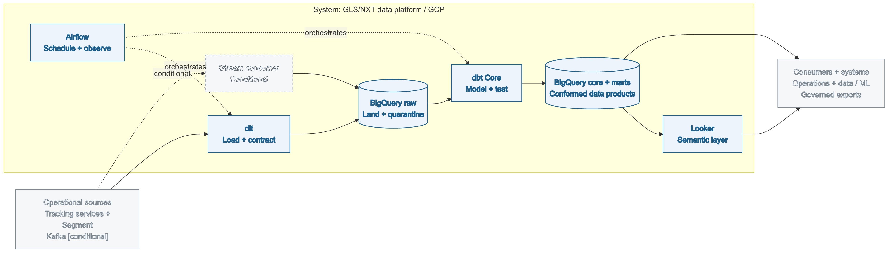
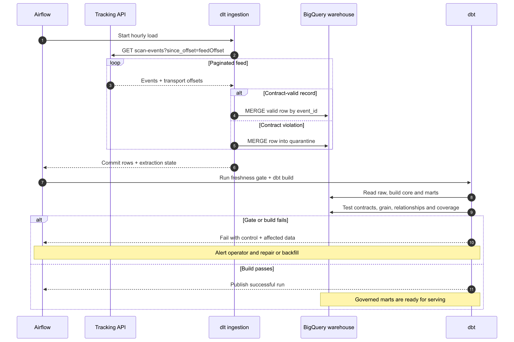
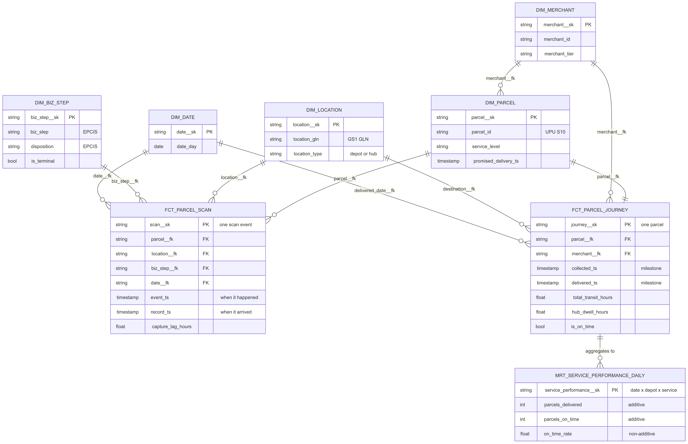
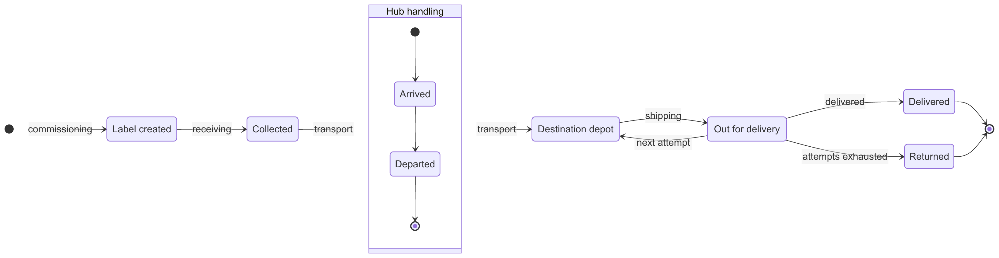

```{=typst}
#set text(fill: rgb("#26333F"))
#show heading: set text(font: "Avenir Next", fill: rgb("#26333F"))
#show heading.where(level: 1): it => block(above: 1.5em, below: 0.7em)[
  #text(size: 14pt, weight: "semibold")[#it.body]
  #v(-0.6em)
  #line(length: 100%, stroke: 0.8pt + rgb("#1F5F8B"))
]
#show heading.where(level: 2): set text(size: 11.5pt, weight: "semibold")
#show heading.where(level: 3): set text(size: 10.5pt, weight: "semibold")
#show table.cell.where(y: 0): set text(weight: "semibold", size: 8.5pt, fill: rgb("#16202A"))
#set table(
  stroke: (x, y) => (
    top: if y == 0 { 0.8pt + rgb("#1F5F8B") } else { 0.3pt + rgb("#D5DDE4") },
    bottom: 0.3pt + rgb("#D5DDE4"),
  ),
  fill: (x, y) => if y == 0 { rgb("#EDF3F8") } else if calc.odd(y) { rgb("#FAFBFC") },
  inset: (x: 6pt, y: 4.5pt),
)
#show table: set text(size: 8.3pt)
#show raw.where(block: true): block.with(
  fill: rgb("#F7F9FB"),
  inset: 7pt,
  radius: 3pt,
  width: 100%,
  stroke: 0.4pt + rgb("#E1E8ED"),
)
#show raw.where(block: true): set text(size: 8pt)
#show figure.caption: set text(font: "Avenir Next", size: 8.2pt, fill: rgb("#5A6B78"))
#set par(justify: true)

#let keypoint(body) = block(
  fill: rgb("#EDF3F8"),
  stroke: (left: 2.5pt + rgb("#1F5F8B")),
  inset: (x: 10pt, y: 8pt),
  radius: (right: 3pt),
  width: 100%,
  body,
)
```

# About

This document specifies a proposal of a governed parcel analytics platform. It
connects operational sources to conformed analytical data products and serves
operations, analysts, data scientists, and group systems. The target stack is
BigQuery, Airflow, dbt Core, and Looker.

The document is shipped as part of a repository which contains an executable local prototype. It uses the same
logical boundaries with REST API as a data source, dlt as the ingestion tool, DuckDB as DWH, dbt as an analytics engineering tool, and
marimo as a frontend for EDA and analytics.

## Repository structure

```text
src/                  tracking API and dlt ingestion
dbt/                  warehouse models, tests, and documentation
analytics/            marimo operator and analytical interface
orchestration/dags/   Airflow target orchestration
looker/views/         LookML semantic definitions
infra/terraform/      GCP infrastructure configuration
docs/                 system specification and formal models
Justfile              shared CLI command surface
```

## Scope

| Area | Common question | Deliverable |
|---|---|---|
| 1. Architecture | What is the system, where is its boundary, and how does it scale? | C4-style container view; component contracts |
| 2. Pipeline | What happens during a run and when it fails? | UML sequence; ingestion and recovery table |
| 3. Data model | What does one row mean and how is history maintained? | ERD diagram; UML parcel state model |
| 4. Enablement | Where are reusable metrics defined and reviewed? | LookML excerpt; consumer interfaces |
| 5. Controls | How is change, access, quality, and documentation governed? | Control matrix; deployment and rollback policy |

## Specifications

- Proposal (this document): standalone specification
- marimo notebook: live operator and presentation interface
- README: repository entry point, with system requirements and deployment steps

## CLI

The repository uses the `Justfile` as its CLI. These recipes define the shared
interfaces for environment setup, prototype execution, the live marimo operator
surface, and artifact generation.

```sh
just env-init       # install Python dependencies
just demo-all       # build, test, and export the guided notebook
just app-notebook   # open the live operator interface
just deliverables   # rebuild diagrams, PDF, and notebook HTML
```

```{=typst}
#pagebreak()
```

# 1. Scalable data platform architecture

## Design principles

The design starts with the system and its interfaces, then construction.
This is the approach I use in data engineering and analytical work.

| Principle | Application |
|---|---|
| Purpose and boundary first | The parcel analytics platform is the system of interest. Sources, consumers, and group systems form its environment. |
| Function before construction | The capability flow is ingest, govern, model, and serve before it is mapped to products. |
| Multiple views for multiple concerns | Containers, runtime behavior, information structure, and parcel state are separate models. |
| Close the feedback loop | Contract, freshness, and coverage failures return affected data and a recovery action to the operator. |
| State the truth condition | Target design, executed prototype, and assumptions carry separate labels. |
| Prefer reversible decisions | Batch, rebuild, and local-tool choices include the condition that replaces them. |

**Methodology:** In the design of the data warehouse and data modeling, I'm using Kimball dimensional modeling approach to define the business process, grain, dimensions, and facts.

## Functional architecture

{width=100%}

**System boundary:** ingestion, analytical storage, transformation, quality,
orchestration, and semantic serving. Source ownership and operational source
availability remain outside. Human decisions remain outside automation.

**Assumptions:**

- Tracking telemetry is the primary business process
- Segment carries product and application events
- BigQuery is the GLS/NXT warehouse
- Minute-level latency is the current requirement; a stricter consumer SLA activates the streaming lane

## Component contracts

| Component | Function | Owns | Boundary |
|---|---|---|---|
| Tracking / Segment / Kafka | Publish source records | Source schema; transport sequence | Analytical definitions |
| dlt ingestion | Extract, normalize, validate, load | Cursor; merge key; quarantine routing | Business metrics |
| Stream consumer, conditional | Land high-volume events in bounded batches | Consumer offsets; lag | Warehouse modeling |
| BigQuery raw | Preserve source-shaped and rejected data | Landing retention; replay horizon | Stable consumer schema |
| dbt Core | Conform, test, document | Model schema; table creation; physical layout | Dataset IAM |
| BigQuery core + marts | Publish facts, dimensions, aggregates | Governed data products | Source availability |
| Looker | Serve reusable measures and exploration | Semantic definitions; audience access | Raw ingestion |
| Airflow | Coordinate and expose run state | Schedule; retry; gate; alert context | Durable business data |

## Quality attributes and scale

| Property | Design response | Verification or signal |
|---|---|---|
| Reliability | Idempotent merge; durable quality gates; explicit replay | Duplicate run convergence; red build on missing events |
| Evolvability | Source-shaped raw layer; additive schema evolution; documented contracts | Unknown-field load test; dbt docs blocks |
| Scalability | BigQuery partitions by event date; clusters by parcel and step; microbatch rebuilds | Partition coverage and model grain tests |
| Security | Environment isolation; least privilege; policy tags; null masking; salted analytical keys | Terraform validation and dbt configuration guards |
| Operability | Airflow target interface; shared CLI command; marimo operator view | Non-zero command exit and visible output |
| Cost | Scheduled batch first; bounded reads; project-level query limits | Partition pruning and warehouse billing telemetry |

## Infrastructure strategy

- **BigQuery is the warehouse.** It owns raw, core, and marts for GLS/NXT.
- **Terraform owns cloud resources.** Projects, datasets, IAM, taxonomy,
  retention, and policy objects are environment-scoped. dbt owns tables because
  it issues their `CREATE` statements.
- **One environment per run.** Destination, raw dataset, and dbt target are
  named once and passed to every stage. Terraform state uses a separate prefix
  per environment.
- **Open-source-driven development.** `uv`, `just`, dlt, DuckDB, dbt Core,
  marimo, Mermaid, Pandoc, and Typst provide a credential-free local path.

## Batch versus Kafka

Scheduled incremental ingestion is the default. The Kafka lane activates with
sustained throughput above 50k events per second, a named sub-minute consumer
SLA, or at least three independent consumers of the same stream. Activation
includes broker lifecycle, schema registry, consumer lag, rebalancing, and
replay operations.

# 2. Pipeline design and orchestration

## Runtime behavior

{width=100%}

The cursor is `feedOffset`, assigned by the tracking feed when it accepts a
record. It is independent of `eventTime` and every payload field the contract
can reject. An offline scanner may deliver a two-day-old event after newer
events; an event-time cursor would discard it before landing.

The target Airflow DAG and local `just demo-build` command preserve the same
ordering: ingest, commit, check freshness, build, test, publish. A failed stage
leaves the run non-green and retains the diagnostic context.

## Ingestion contract

| Concern | Contract | Failure behavior |
|---|---|---|
| Incremental position | `feedOffset` is monotonic per accepted record | Load state commits before cursor advancement |
| Idempotency | `event_id` is the merge key | Overlap and retry converge |
| Required fields | EPCIS what, when, where, and why fields are non-null | Record is merged into quarantine with reason |
| Schema evolution | Unknown scalar and nested fields are retained | Parent schema expands; nested unknowns are serialized |
| Trust boundary | Loader-owned keys retain authority | Payload collisions move under a `source_` prefix |
| Retention clock | `landed_at` records warehouse arrival | Historical replay receives a fresh retention window |

**Executed prototype:** `src/sources/tracking_source.py`

```python
@dlt.resource(selected=False)
def scan_event_pages(
    api_base_url: str = dlt.config.value,
    feed_offset=dlt.sources.incremental("feedOffset", initial_value=INITIAL_FEED_OFFSET),
):
    """Page the tracking API from the incremental watermark forward."""
    params = {"per_page": PAGE_SIZE, "since_offset": feed_offset.last_value}
    yield from _client(api_base_url, "events").paginate(
        "/v1/scan-events", params=params
    )
```

## Failure and recovery

| Condition | Detection | Response | Recovery |
|---|---|---|---|
| Duplicate or replay | Existing `event_id` | Merge converges to one row | Idempotent retry |
| Contract violation | Required-field check | Quarantine; continue load | Correct producer; replay retained input |
| Source stale | dbt source freshness | Fail before modeling | Restore source; rerun |
| Quarantine drift | Latest load exceeds 1% | Fail dbt build | Treat as source incident |
| Event outside seven-day lookback | Fact coverage test | Keep build red; name missing dates | `just dwh-backfill <start> <end>` |
| Transient API error | Task exception | Retry with exponential backoff | Alert after retry budget |
| Warehouse or test error | Non-zero dbt exit | Run stays failed; publication gate stays closed | Repair and rerun idempotently |

Controls query durable warehouse state, which survives worker failure and data
commit.

Quality remains layered: ingestion contracts, source freshness, model integrity,
product reconciliation, and distribution anomalies. The platform owns transport
and run health; the analytical owner owns metric meaning and thresholds.

```{=typst}
#pagebreak()
```

# 3. Data modeling and warehousing

## Grain first

The business process is parcel movement. EPCIS supplies the event vocabulary;
the warehouse separates the transaction history from the evolving journey.

| Model | Kimball pattern | Declared grain | Primary analytical use |
|---|---|---|---|
| `fct_parcel_scan` | Transaction fact | One row per scan event | Event volume, capture lag, step analysis |
| `fct_parcel_journey` | Accumulating snapshot | One row per parcel | Milestones, dwell, delivery outcome |
| `mrt_service_performance_daily` | Periodic aggregate | Delivery date × depot × service level | Scorecards and trend queries |

Conformed dimensions are parcel, location, merchant, business step, and date.
Facts carry surrogate foreign keys and retain the carrier event identifier as a
degenerate dimension. Unknown dimension keys remain null until a dimension
member can be resolved.

{width=80%}

## Parcel lifecycle

{width=100%}

The state model defines valid milestone order. The scan fact records transitions;
the journey snapshot records the first or final milestone timestamps and the
durations between them. A repeat delivery attempt returns to the destination
depot state and preserves one parcel journey.

## Incremental and physical design

**Executed prototype:** `dbt/models/core/fct_parcel_scan.sql`

```sql
{{ config(
    materialized='incremental',
    incremental_strategy='microbatch',
    event_time='event_date',
    batch_size='day',
    lookback=var('scan_capture_lookback_days'),
    begin=var('scan_history_begin'),
    concurrent_batches=false,
    on_schema_change='sync_all_columns',
    labels={'domain': 'tracking', 'grain': 'parcel_scan'},
    tags=['tracking', 'hourly']
) }}
```

| Decision | Reason | Replacement condition |
|---|---|---|
| Daily microbatch scan fact | Each day is independently retryable and backfillable | Workload or adapter requires a different batch strategy |
| Seven-day routine lookback | Covers the observed offline-scanner lag distribution | Capture-lag telemetry requires a larger window |
| Full journey rebuild | Parcel-master changes arrive independently of scans | Rebuild cost justifies a parcel-master snapshot and changed-key union |
| Event-date partition | Routine and backfill reads share one pruning axis | Query pattern changes materially |
| Parcel and step clustering | Supports journey and process-step access paths | Representative billing telemetry shows neutral or adverse cost |
| dbt owns table layout | dbt creates and replaces the table | Another engine becomes the sole table creator |

## Retention, access, compliance

- Raw tables partition on `landed_at` and expire after 90 days. dlt state tables,
  core models, and marts use persistent analytical retention.
- `assert_raw_covers_history_floor` enforces raw coverage through the published
  history floor.
- Terraform grants analysts to core and marts. Raw access is restricted to
  pipeline identities. Dataset boundaries assign new tables to their audience.
- Terraform creates policy tags and masking policies. dbt attaches the tag to
  the column it creates. The human query result is null-masked; salted surrogate
  keys support permitted grouping while keeping the tracking number confined to
  its governed column.
- Encryption in transit and at rest uses managed GCP controls. Secrets and
  environment-specific tag identifiers enter through the deployment environment.

```{=typst}
#pagebreak()
```

# 4. Visualization and business enablement

## Semantic contract

Looker is the target semantic and exploration surface. Measures are defined as
ratios of additive building blocks. Queries aggregate numerator and denominator
before division at depot, service, and date grain.

**Target-state artifact:** `looker/views/parcel_journey.view.lkml`

```lookml
measure: parcels_delivered {
  label: "Parcels Delivered"
  type: count_distinct
  sql: ${journey__sk} ;;
  filters: [is_delivered: "yes"]
}

measure: on_time_delivery_rate {
  label: "On-Time Delivery Rate"
  description: "Share of delivered parcels that met the contracted promise."
  type: number
  value_format_name: percent_1
  sql: safe_divide(${parcels_on_time}, ${parcels_delivered}) ;;
}
```

| Consumer | Interface | Guardrail |
|---|---|---|
| Operations | Looker scorecard and governed alerts | Curated marts; stable service definitions |
| Analysts | Looker Explore and approved core SQL | Conformed dimensions; documented grain |
| Data scientists | Core facts and feature queries | Point-in-time rules; governed identifier access |
| Platform operator | Airflow in target state; marimo and CLI locally | One run contract and visible failure output |
| Downstream systems | Approved marts through versioned exports | Governed mart contract and access policy |

## Definition workflow

1. Analyst or PM states the business question, grain, denominator, and examples.
2. Data engineer maps the definition to conformed facts and identifies affected
   consumers.
3. Tests encode boundary examples and reconciliation to the source fact.
4. The owner reviews the semantic change and release note.
5. dbt and LookML publish together; deprecation precedes removal.

## Measured prototype results

| Metric | Result |
|---|---:|
| Modeled scan events | 33,113 |
| Parcel journeys | 4,000 |
| Delivered journeys | 3,997 |
| On-time delivery | 92.094% |
| First-attempt delivery | 87.466% |
| Quarantined records | 3 |

Express parcels with hub dwell above eight hours are on time 23.4% of the time,
versus 85.1% below eight hours. This synthetic result validates duration analysis
through the accumulating snapshot.

```{=typst}
#pagebreak()
```

# 5. Cross-cutting controls

## Control matrix

| Concern | Target-state control | Prototype implementation |
|---|---|---|
| Contract | Versioned source schema and compatibility policy | dlt required fields and quarantine fan-out |
| Quality | Ingestion, freshness, schema, business-rule, and anomaly layers | dbt build completes with 97 passing resources and checks |
| Security | Least privilege, environment isolation, policy tags, null masking | Terraform and dbt guards; configuration validation |
| Privacy | Pseudonymous event IDs and salted analytical keys | Non-recoverability tests and configuration |
| Retention | Landing-time partition expiry; replay horizon control | Partition hints and raw-history coverage test |
| Lineage | Source-to-metric lineage in dbt and Looker | Model graph, refs, sources, and docs blocks |
| Observability | Run state, freshness, affected dates, consumer lag, cost | Live command status; Airflow DAG is design-only |
| Documentation | Versioned architecture, model docs, runbooks, ownership | Markdown, Mermaid, dbt docs, OpenSpec |

## CI/CD and rollback

| Stage | Required checks | Promotion / rollback |
|---|---|---|
| Pull request | Python lint; dbt parse; changed-model build; DAG parse; Terraform format and validate; docs render | Merge requires every check to pass |
| Development | Isolated dataset; deterministic fixtures; contract and replay tests | Drop isolated dataset |
| Production | Terraform plan approval; dbt build against production target; freshness gate | Revert artifact; rebuild affected partitions |
| Semantic release | Model and LookML validation; metric reconciliation | Restore prior model and semantic revision |

Schema changes are classified before deployment:

- Additive compatible fields flow into raw, then require an explicit modeled
  contract before publication.
- Renames and type changes are versioned or dual-published through a deprecation
  window.
- Destructive infrastructure changes require an approved plan and a verified
  recovery path.
- Backfill uses bounded event dates. Local prototype setup uses a full reset;
  production recovery uses bounded repair.

## Operating invariants

1. A successful run means ingestion committed, freshness passed, models built,
   and tests passed.
2. A control that must survive task failure reads durable state.
3. A table's creator owns its schema and physical layout.
4. Raw retention defines the replay horizon; an archive extends it.
5. The prototype proves local behavior only. Unexecuted cloud controls remain
   target-state configuration.
